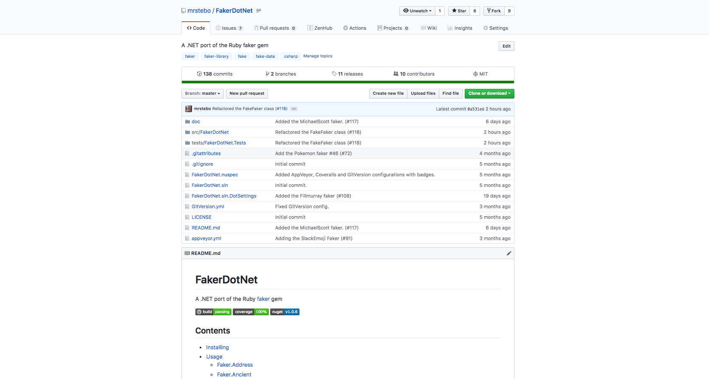
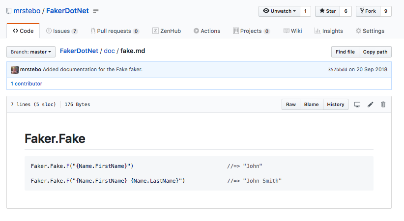
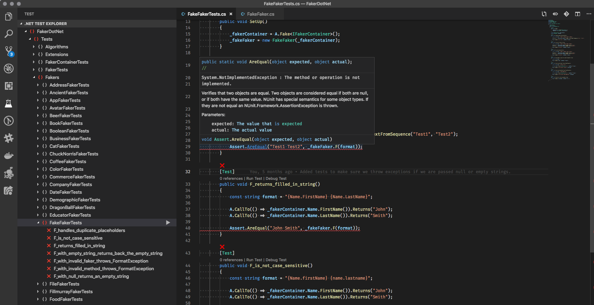
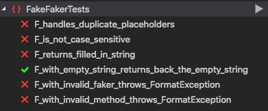
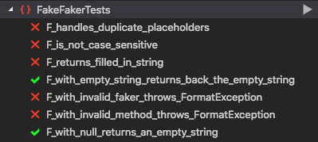
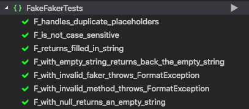
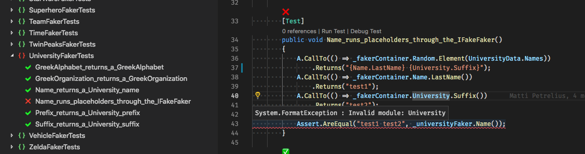
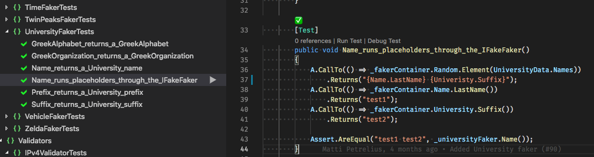

## Reflecting on Reflection in an open source library

---

#### Say @emoji[wave] to
## @color[#DC143C](FakerDotNet)

---



---

#### Say another @emoji[wave] to the
## @color[#DC143C](`FakeFaker`)

---



---

### What does it do?

---

@ul

- Looks for @color[#DC143C](**{FakerName.Method}**) in a string
- Replaces with the result of a call to the faker method

@ulend

---

### So this

@size[0.7em]("My name is @color[#DC143C]({Faker.FirstName} {Faker.LastName})")

---

### Turns into this

@size[0.7em]("My name is @color[#DC143C](John Smith)")

---

## How can we implement this?

---

#### The interface

@code[cs zoom-13](assets/code/baseplate/interface.cs)

@[3-6]
@[5](descriptive...right? @emoji[see_no_evil])

---

#### The class

@code[cs zoom-06](assets/code/baseplate/class.cs)

@[9-12](We need to inject the `IFakerContainer`)
@[7](We'll use this later @emoji[wink])
@[14-17](The magical `F` method)
@[16](Right now it doesn't do anything @emoji[sweat_smile])

---

### How do we make sure it works?

---

## BY
# WRITING
### @color[#DC143C](UNIT TESTS)
#### @emoji[tada]

---

# @color[#92F11A](NUnit)

@snap[south fragment]
[https://nunit.org/]()
@snapend

---

# @color[#FCE41C](FakeItEasy)

@snap[south fragment]
[https://fakeiteasy.github.io/]()
@snapend
---

@code[cs zoom-06](assets/code/tests/FakeFakerTests.cs)

@[2](I am using the @color[#DC143C](**FakeItEasy**) package)
@[4](I am using @color[#DC143C](**NUnit**) for the test framework)
@[19-20](These are used by the tests)
@[15](Creating a mockable @color[#DC143C](`IFakerContainer`))
@[16](Then I inject the mock into the @color[#DC143C](`FakeFaker`) class)
@[22-30]
@[32-41]
@[43-52]
@[54-60]
@[62-70]
@[72-80]
@[82-86]

---



---

@snap[fragment]
#### @color[#ACA4AC](While we are here...)
@snapend

@snap[fragment]
## @color[#DC143C](TDD)
#### @emoji[nerd_face]
@snapend

---
@transition[none]

```cs
public string F(string format)
{
    throw new NotImplementedException();
}
```

---
@transition[none]

```cs
public string F(string format)
{
    return format;
}
```

---
@transition[none]



---
@transition[none]

```cs
public string F(string format)
{
    if (string.IsNullOrEmpty(format)) return string.Empty;

    return format;
}
```

---
@transition[none]



---

@snap[fragment]
#### Lets implement this
@snapend

@snap[fragment]
### @color[#DC143C](without reflection)
@snapend

---
@transition[none]

@code[cs zoom-06](assets/code/manual/FakeFaker_basic.cs)

@[20-36]
@[22](Already covered this case and have @color[#DC143C](tests passing) @emoji[raised_hands])
@[24-35](This will be our focus)

---
@transition[none]

@code[cs zoom-06](assets/code/manual/FakeFaker_basic.cs)

@[25]
@[86-93]
@[88-90](Extracted from a call to @color[#DC143C](`Regex.Match`))
@[91]("{@color[#DC143C](Name)}.{Method}")
@[92]("{Name}.{@color[#DC143C](Method)}")

---
@transition[none]

@code[cs zoom-06](assets/code/manual/FakeFaker_basic.cs)

@[26]
@[38-53]
@[40](Returns matches when strings contain @color[#DC143C]({Name}.{Method}))
@[41](Look for the @color[#DC143C](first match) in the string)
@[44-51](@color[#DC143C](GREAT!) We have found a match @emoji[thumbsup])
@[52](No matches)
@[52](No need to explicitly set `Success` to false @emoji[wink])

---
@transition[none]

@code[cs zoom-06](assets/code/manual/FakeFaker_basic.cs)

@[28]
@[55-69]
@[57](Holds our @color[#DC143C](output) value)
@[58](Convert the faker to @color[#DC143C](lower case))
@[60](Have a case for @color[#DC143C](each faker name))
@[61](Get the value from that particular faker)
@[68](Return the value)
@[64-65, 68]
@[65](That faker @color[#DC143C](doesn't exist))
@[68](When calling the faker method @color[#DC143C](null) was returned)

---
@transition[none]

@code[cs zoom-06](assets/code/manual/FakeFaker_basic.cs)

@[71-84]
@[73](Convert the method to @color[#DC143C](lower case))
@[75, 78](Have a case for @color[#DC143C](each method))
@[76, 79](Return the value from the invokation of the method)
@[82](Otherwise return @color[#DC143C](null))

---
@transition[none]

@code[cs zoom-06](assets/code/manual/FakeFaker_basic.cs)

@[28]
@[29-30]
@[32](@color[#DC143C](Inject) the new value into the string)
@[26](@color[#DC143C](Search) for another match)
@[35](@color[#DC143C](Return) when no more matches are found)

---

## Now when we run the tests...

@emoji[pray]

---



@emoji[raised_hands] @emoji[sunglasses] @emoji[tada]

---

### However...when we start using it in other faker modules
@emoji[flushed]

---



---

@snap[fragment]
#### Looks like we'll need a
## @color[#DC143C](BIGGER)
### switch statement
@snapend

@snap[fragment]
@emoji[see_no_evil]
@snapend

---
@transition[none]

@code[cs zoom-07](assets/code/manual/FakeFaker_with_bigger_switch.cs)

@[58-74]
@[68-70]

---
@transition[none]

@code[cs zoom-05](assets/code/manual/FakeFaker_with_bigger_switch.cs)

@[127-149]
@[137-138]

---



---

## Why is this a
# @color[#DC143C](BAD)
## approach?

@emoji[thinking_face]

---

### We have to
# @color[#DC143C](MODIFY)
## the `FakeFaker` class
#### every time we add a new faker

---

### The `FakeFaker` class will get
## @color[#DC143C](BIGGER)
#### and
# @color[#DC143C](BIGGER)

---

### Someone may
# @color[#DC143C](MISS OUT)
#### a method

---

## There could be
# @color[#DC143C](TYPOS)
### in the switch statement

---

@snap[fragment]
## Granted...
@snapend

@snap[fragment]
### @color[#DC143C](Tests) should find the last two issues
@snapend

---

@snap[fragment north]
### But really...
@snapend

@snap[fragment]
#### Is this
@snapend

@snap[fragment]
## @color[#DC143C](MANAGEBLE)
@snapend

---

@snap[fragment]
### We can improve this using
@snapend

@snap[fragment]
# @color[#DC143C](REFLECTION)
@emoji[raised_hands]
@snapend

---

### What is Reflection?

@emoji[thinking_face]

---
